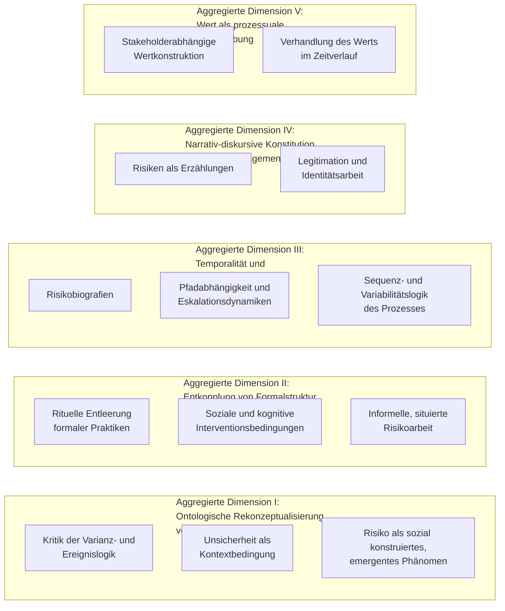

# Gioia-Kodiersystem: Projektrisikomanagement aus prozesstheoretischer Perspektive

**Basis:** Arbeitspapier „Projektrisikomanagement aus prozesstheoretischer Perspektive: Eine narrative Literaturübersicht, Synthese und Forschungsagenda" (28.07.2026), ergänzt um eine Verifikationsrecherche (Juli 2026).

**Methodischer Hinweis:** Die Gioia-Methodologie (Gioia, Corley & Hamilton, 2013) wurde für die induktive Analyse von Interviewdaten entwickelt. Hier wird sie in übertragener Form auf eine Literatursynthese angewendet: Die Konzepte 1. Ordnung sind quellennahe Befunde und Formulierungen der Primärliteratur („informant-centric" im Sinne der Autorenstimmen), die Themen 2. Ordnung sind analytische Verdichtungen („researcher-centric"), die aggregierten Dimensionen bilden die theoretische Spitze der Datenstruktur. Diese Übertragung ist als konzeptionelle Adaption gekennzeichnet.

---

## 1. Datenstruktur im Überblick

---

## 2. Vollständige Datenstruktur (Konzepte 1. Ordnung → Themen 2. Ordnung → Aggregierte Dimensionen)

### Aggregierte Dimension I: Ontologische Rekonzeptualisierung von Risiko — vom objektiven Ereignis zum emergenten Werden

| Konzepte 1. Ordnung (quellennahe Befunde) | Themen 2. Ordnung |
|---|---|
| • Zusammenhang zwischen formalem Risikomanagement und Projekterfolg bleibt empirisch inkonsistent (Willumsen et al., 2019; Green & Dikmen, 2022)   • Standards fixieren Risiko auf diskrete, ex ante identifizierbare Ereignisse (Ward & Chapman, 2003)   • Unsicherheit lässt sich nicht vollständig probabilistisch abbilden (Perminova et al., 2008; Ramasesh & Browning, 2014)   • Der normative „Risikomanagementprozess" wird theoretisch als Varianzmodell behandelt: Input Compliance → Output Erfolg | **I.1 Kritik der Varianz- und Ereignislogik** |
| • Verschiebung vom Risiko- zum Unsicherheitsmanagement, inkl. Chancenperspektive (Ward & Chapman, 2003)   • Unsicherheit ist Kontextbedingung des Projekts, nicht Restgröße (Perminova et al., 2008)   • „Knowable unknown unknowns": prinzipiell erkennbares Unbekanntes als eigene Kategorie (Ramasesh & Browning, 2014) | **I.2 Unsicherheit als Kontextbedingung des Projekts** |
| • Risiken *werden* im Projektverlauf: Sie werden erkannt, benannt, priorisiert, ignoriert, verhandelt und transformiert   • Sensemaking und Reflexion in Echtzeit ersetzen die Illusion vollständiger Ex-ante-Planbarkeit (Perminova et al., 2008)   • Unsicherheit als gelebte Erfahrung („withness"-Perspektive; Sergi et al., 2020) | **I.3 Risiko als sozial konstruiertes, emergentes Phänomen** |

### Aggregierte Dimension II: Entkopplung von Formalstruktur und gelebter Risikopraxis

| Konzepte 1. Ordnung (quellennahe Befunde) | Themen 2. Ordnung |
|---|---|
| • Risikomanagement degradiert zur „administrativen Übung" (Kutsch & Hall, 2010)   • „Deliberate ignorance": bewusstes Ausblenden bekannter Risiken (Kutsch & Hall, 2010)   • Registerpflege als Compliance-Ritual ohne Entscheidungsrelevanz (Willumsen et al., 2024) | **II.1 Rituelle Entleerung formaler Praktiken** |
| • Tabus und Untopikalität verhindern die Thematisierung bekannter Risiken (Kutsch & Hall, 2010)   • Nützlichkeitskalküle und Relevanzentscheidungen filtern den formalen Prozess (Kutsch & Hall, 2009)   • Macht-, Struktur- und Kontextbedingungen prägen die situierte Praxis (Cicmil et al., 2006) | **II.2 Soziale und kognitive Interventionsbedingungen** |
| • Gelebte Praxis („actuality") weicht systematisch von den Vorgaben ab (Cicmil et al., 2006; Willumsen et al., 2024)   • Formale Praktiken werden durch informelle Gespräche und situative Risikoarbeit ergänzt oder ersetzt (Willumsen et al., 2024)   • Workshops, Registerpflege und informelle Interaktionen als eigentliche Orte der Risikoarbeit (Praxisperspektive; Sergi et al., 2020) | **II.3 Informelle, situierte Risikoarbeit** |

### Aggregierte Dimension III: Temporalität und Risikotrajektorien

| Konzepte 1. Ordnung (quellennahe Befunde) | Themen 2. Ordnung |
|---|---|
| • Risiken haben Biografien: Sie entstehen, wandern durch Register, werden re-priorisiert, verschwinden oder materialisieren sich   • Risikoregister und Risikoprofile entwickeln sich über Projektphasen (Prozess als Evolution; Sergi et al., 2020)   • Temporalität, Aktivität und Fluss als konstitutive Analysedimensionen (Langley et al., 2013) | **III.1 Risikobiografien** |
| • Pfadabhängigkeiten prägen den Risikoverlauf (Sergi et al., 2020)   • Eskalationsdynamiken: Overcommitment, Ignorieren von Warnsignalen   • Irrelevanzzuschreibungen bauen sich auf, stabilisieren sich und kippen ggf. vor Krisenereignissen (Forschungslücke 4 des Arbeitspapiers) | **III.2 Pfadabhängigkeit und Eskalationsdynamiken** |
| • Der neunstufige Risikomanagementprozess als testbare „Level-1-Prozesstheorie" (Niederman et al., 2018)   • Aktions- und Sequenzvariabilität: Verändert eine andere Reihenfolge der Aktivitäten das Ergebnis? (Niederman et al., 2018)   • Ergebnis-Trade-offs alternativer Aktivitätsverläufe als Untersuchungsgegenstand | **III.3 Sequenz- und Variabilitätslogik des Prozesses** |

### Aggregierte Dimension IV: Narrativ-diskursive Konstitution des Risikomanagements

| Konzepte 1. Ordnung (quellennahe Befunde) | Themen 2. Ordnung |
|---|---|
| • Risiken existieren als Erzählungen (Prozess als Narrativ; Sergi et al., 2020)   • Narrative Strukturen führen Prozesse von der Deskription zur Erklärung (Pentland, 1999)   • Risikonarrative wandeln sich im Zeitverlauf und wirken performativ auf Entscheidungen (Forschungslücke 5 des Arbeitspapiers) | **IV.1 Risiken als Erzählungen** |
| • Dominantes Narrativ wissenschaftlicher Rationalität verdeckt die diskursive Funktion des Risikomanagements (Green & Dikmen, 2022)   • Risikoberichte dienen als Legitimations- und Selbstdarstellungsinstrumente   • Risikomanagement als Identitätsarbeit der Akteure (Green & Dikmen, 2022) | **IV.2 Legitimation und Identitätsarbeit** |

### Aggregierte Dimension V: Wert des Risikomanagements als prozessuale Zuschreibung

| Konzepte 1. Ordnung (quellennahe Befunde) | Themen 2. Ordnung |
|---|---|
| • Der Wertbeitrag des Risikomanagements ist subjektiv und stakeholderabhängig (Willumsen et al., 2019)   • Wert ist keine objektive Outputgröße des formalen Prozesses | **V.1 Stakeholderabhängige Wertkonstruktion** |
| • Wert wird von Stakeholdern im Zeitverlauf zugeschrieben und verhandelt (Willumsen et al., 2019)   • Die prozessuale Wertzuschreibung erklärt die inkonsistente Befundlage varianztheoretischer Erfolgsstudien | **V.2 Verhandlung des Werts im Zeitverlauf** |

---

## 3. Kodierleitfaden (Kurz-Codebook)

| Code | Definition | Ankerbeispiel (aus der Literatur) | Abgrenzung |
|---|---|---|---|
| **I.1** Kritik der Varianz-/Ereignislogik | Aussagen, die die Erklärungskraft des Input-Output-Modells (Compliance → Erfolg) oder die Ereignisfixierung des Risikobegriffs infrage stellen | „Der Zusammenhang zwischen formalem Risikomanagement und Projekterfolg bleibt empirisch inkonsistent" | Nicht kodieren: bloße Implementierungskritik ohne theoretischen Anspruch (→ II) |
| **I.2** Unsicherheit als Kontext | Aussagen, die Unsicherheit als durchgängige Bedingung des Projekts statt als quantifizierbare Restgröße fassen | „Unsicherheit ist Kontextbedingung des Projekts, nicht nur Restgröße" | Nicht kodieren: probabilistische Risikoquantifizierung |
| **I.3** Soziale Konstruktion/Emergenz | Aussagen zum „Werden" von Risiken durch Erkennen, Benennen, Verhandeln; Sensemaking in Echtzeit | „Risiken werden erkannt, benannt, priorisiert, ignoriert, verhandelt und transformiert" | Abgrenzung zu IV: dort steht die narrative *Form*, hier der Konstruktionsprozess im Vordergrund |
| **II.1** Rituelle Entleerung | Formale Praktiken, die ohne Entscheidungsrelevanz fortgeführt werden | „Risikomanagement degradiert zur administrativen Übung" | Abgrenzung zu II.3: hier Fortbestand der Form, dort deren Ersetzung |
| **II.2** Interventionsbedingungen | Soziale/kognitive Mechanismen (Tabus, Relevanzkalküle, Macht), die den formalen Prozess unterlaufen | „Bewusstes Ausblenden bekannter Risiken durch Tabus, Untopikalität, Nützlichkeitskalküle" | Mechanismen kodieren, nicht deren Resultat (→ II.1) |
| **II.3** Informelle Risikoarbeit | Situierte, nicht formalisierte Praktiken der Risikobearbeitung | „Formale Praktiken werden durch informelle ergänzt oder ersetzt" | — |
| **III.1** Risikobiografien | Verlaufsbeschreibungen einzelner Risiken über die Zeit | „Risiken entstehen, wandern durch Register, werden re-priorisiert, verschwinden oder materialisieren sich" | Einzelrisiko-Trajektorie, nicht Prozessarchitektur (→ III.3) |
| **III.2** Pfadabhängigkeit/Eskalation | Selbstverstärkende Verlaufsdynamiken | „Overcommitment, Ignorieren von Warnsignalen" | — |
| **III.3** Sequenz-/Variabilitätslogik | Aussagen zur Reihenfolge, Substitution und Variation von Prozessaktivitäten | „Verändert eine andere Reihenfolge der Aktivitäten das Ergebnis?" | — |
| **IV.1** Risiken als Erzählungen | Narrative Existenz- und Erklärungsform von Risiken | „Narrative als Weg von der Beschreibung zur prozessualen Erklärung" | — |
| **IV.2** Legitimation/Identität | Diskursive Funktionen des Risikomanagements jenseits der Steuerung | „Risikoberichte sind auch Legitimations- und Selbstdarstellungsinstrumente" | — |
| **V.1** Wertkonstruktion | Subjektivität und Stakeholderabhängigkeit des Wertbeitrags | „Der Wertbeitrag ist subjektiv und stakeholderabhängig" | — |
| **V.2** Wertverhandlung | Zeitliche Dynamik der Wertzuschreibung | „Wert wird im Zeitverlauf zugeschrieben und verhandelt" | — |

---

## 4. Theoretische Verdichtung

Die fünf aggregierten Dimensionen lassen sich zu einem prozesstheoretischen Kernargument verbinden: Risikomanagement in Projekten ist kein Regelkreis, der Risiken als objektive Ereignisse abarbeitet (Dimension I widerlegt diese Ontologie), sondern ein zeitlich entfaltetes soziales Geschehen, in dem Formalstruktur und Praxis systematisch auseinandertreten (Dimension II), Risiken Biografien mit Pfadabhängigkeiten durchlaufen (Dimension III), narrative und diskursive Funktionen die instrumentelle Funktion überlagern (Dimension IV) und der Wert des Ganzen erst im Prozess der Zuschreibung entsteht (Dimension V). Die Dimensionen III–V spezifizieren dabei die Mechanismen, über die sich die in Dimension II beschriebene Entkopplung erklären lässt; Dimension I liefert die ontologische Begründung des Perspektivwechsels.

---

## 5. Quellenkorrektur und Verifikationshinweise

- **Sergi, Crevani & Aubry (2020), „Process studies of project organizing"** erschien im *Project Management Journal*, 51(1), 3–10 — nicht, wie im Arbeitspapier angegeben, im *International Journal of Project Management*.
- **Green & Dikmen (2022)** ist verifiziert: *Project Management Journal*, DOI 10.1177/87569728221124496.
- Die übrigen bibliografischen Angaben des Arbeitspapiers sind vor Zitation an den Originalquellen zu prüfen (siehe dortige Limitationen, Abschnitt 7).

## Literaturbasis (Kodierquellen)

- Cicmil, S., Williams, T., Thomas, J., & Hodgson, D. (2006). Rethinking Project Management: Researching the actuality of projects. *IJPM, 24*(8), 675–686.
- Gioia, D. A., Corley, K. G., & Hamilton, A. L. (2013). Seeking qualitative rigor in inductive research: Notes on the Gioia methodology. *Organizational Research Methods, 16*(1), 15–31.
- Green, S. D., & Dikmen, I. (2022). Narratives of Project Risk Management. *PMJ*.
- Kutsch, E., & Hall, M. (2009). The effect of intervening conditions on the management of project risk. *IJPM*.
- Kutsch, E., & Hall, M. (2010). Deliberate ignorance in project risk management. *IJPM, 28*(3), 245–255.
- Langley, A., Smallman, C., Tsoukas, H., & Van de Ven, A. H. (2013). Process studies of change in organization and management. *AMJ, 56*(1), 1–13.
- Niederman, F., Müller, B., & March, S. T. (2018). Using Process Theory for Accumulating Project Management Knowledge. *PMJ, 49*(1).
- Pentland, B. T. (1999). Building process theory with narrative. *AMR, 24*(4), 711–724.
- Perminova, O., Gustafsson, M., & Wikström, K. (2008). Defining uncertainty in projects. *IJPM, 26*(1), 73–79.
- Ramasesh, R. V., & Browning, T. R. (2014). A conceptual framework for tackling knowable unknown unknowns. *JOM, 32*(4), 190–204.
- Sergi, V., Crevani, L., & Aubry, M. (2020). Process studies of project organizing. *PMJ, 51*(1), 3–10.
- Ward, S., & Chapman, C. (2003). Transforming project risk management into project uncertainty management. *IJPM, 21*(2), 97–105.
- Willumsen, P., Oehmen, J., Stingl, V., & Geraldi, J. (2019). Value creation through project risk management. *IJPM, 37*(5), 731–749.
- Willumsen, P. L., Oehmen, J., & Selim, H. M. R. (2024). Project risk management in practice. *IJMPB, 17*(4/5), 593–617.
